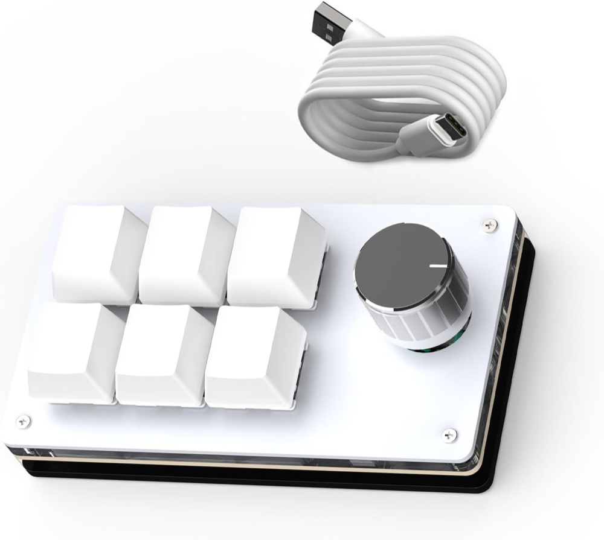

# pi-setup

Portable, auth-free setup for my [Pi coding agent](https://pi.dev) configuration.

This repo is designed to be safe to use across macOS and Linux machines. It stores only configuration and resources that are useful on another computer, not credentials or local runtime state.

It also acts as a public index of the Pi extensions I use and maintain. See [`docs/extensions.md`](docs/extensions.md).

Reusable, provider-neutral instruction templates are available in the review
skill's bundled
[`AGENTS.example.md`](config/skills/review-global-agents/references/AGENTS.example.md)
and [`docs/STACK_CONVENTIONS.example.md`](docs/STACK_CONVENTIONS.example.md). They are
examples to adapt, not files automatically installed as global instructions.

The installed `/skill:review-global-agents` workflow audits an existing global
`AGENTS.md`, compares it with the bundled example and orchestration rubric, helps
resolve policy conflicts, previews a candidate diff, and requires approval plus a
backup before replacing the user's file.

## What this restores

`./apply.sh` applies the portable snapshot from `config/`. Most resources go into `~/.pi/agent/`; the Pi Lens policy goes to `~/.pi-lens/config.json`:

- `settings.json` package/resource configuration
- `keybindings.json`
- empty `models.json` placeholder so provider/model choices are not forced
- empty `mcp.json` placeholder so MCP servers/auth are not forced
- prompt templates in `prompts/`
- authored or vendored `extensions/`, `skills/`, and `themes/` if present
- locked runtime dependencies for the vendored `web-tools` extension (installed with `npm ci`)
- global Pi Lens config at `~/.pi-lens/config.json`, keeping LSP/code intelligence enabled while disabling automatic formatting
- CH57x macro-pad profile and `/macropad` cheat sheet under `~/.config/ch57x-keyboard-tool/`
- auth-free extension preference files, currently:
  - `pi-handoff-config.json`
  - `pi-usage-bar/config.json`

## What this never stores

Do **not** commit these Pi files/directories here:

- `auth.json`
- `mcp-oauth/`
- `sessions/`
- `usage/`
- `run-history.jsonl`
- `trust.json`
- `mcp-cache.json`
- `mcp-onboarding.json`
- `projects-memory/`
- `pi-hermes-memory/`
- API keys, OAuth tokens, cookies, passwords, or client secrets

See [`docs/security.md`](docs/security.md) for the public-repo safety model.

## Usage on a new machine

The easiest cross-platform install/apply path is direct from GitHub:

```bash
npx --yes github:ttiimmaahh/pi-setup
```

Preview without writing files:

```bash
npx --yes github:ttiimmaahh/pi-setup -- --dry-run
```

Skip package reconciliation:

```bash
npx --yes github:ttiimmaahh/pi-setup -- --no-update
```

Override the Pi Lens config destination when testing or using a non-default home layout:

```bash
PI_LENS_CONFIG_PATH=/custom/path/config.json npx --yes github:ttiimmaahh/pi-setup
```

Manual clone/apply still works:

```bash
git clone https://github.com/ttiimmaahh/pi-setup.git
cd pi-setup
bash apply.sh
```

On Windows PowerShell:

```powershell
git clone https://github.com/ttiimmaahh/pi-setup.git
cd pi-setup
powershell -ExecutionPolicy Bypass -File .\Apply.ps1
```

Pi itself requires a bash shell on Windows; [Git for Windows](https://git-scm.com/download/win) is usually enough.

Then authenticate separately:

```bash
pi
# run /login, or configure provider API key environment variables
```

## Optional voice-dictation macro pad

I use a small **3×2 CH57x macro keyboard with a rotary knob** as a dedicated Pi controller. The included profile maps its voice button to `Ctrl+Shift+V`: tap once to start local dictation in Pi, then tap again to stop and insert the transcript. It also includes shortcuts for submit, escape, interrupt, details, planning mode, model selection, and effort controls.

[](https://amzn.to/4pMdCj6)

[View the macro keyboard used for this setup on Amazon](https://amzn.to/4pMdCj6).

> **Affiliate disclosure:** These are Amazon affiliate links. I may earn a commission from qualifying purchases at no additional cost to you.

Applying this repo installs the profile and cheat sheet, but deliberately does **not** flash attached hardware automatically. Install `ch57x-keyboard-tool`, connect the controller, review [`docs/macropad.md`](docs/macropad.md), and explicitly upload the profile when ready.

If the Pi CLI is not installed yet:

```bash
npm install -g --ignore-scripts @earendil-works/pi-coding-agent
```

## Refreshing the snapshot from this machine

After changing your Pi setup, run:

```bash
bash export.sh
bash security-scan.sh
```

On Windows PowerShell:

```powershell
powershell -ExecutionPolicy Bypass -File .\Export.ps1
powershell -ExecutionPolicy Bypass -File .\SecurityScan.ps1
```

Review the diff before committing. Export reconciles deleted resource directories and
excludes installer-managed integration shims such as Herdr's
`herdr-agent-state.ts`; reinstall those integrations separately on each machine.

## Local package paths

This public setup intentionally excludes local package paths from `config/settings.json` so it works for other users via `npx github:ttiimmaahh/pi-setup`. See [`docs/local-packages.md`](docs/local-packages.md) for the private/local-development escape hatch.

## Releasing

This repo has npm package metadata only so users can run it directly from GitHub with `npx`. It is marked `private` and is not intended for npm registry publication.

Release flow:

```bash
npm version patch   # or minor/major
git push --follow-tags
```

The tag-driven GitHub Action verifies the tag matches `package.json`, runs `npm run check`, and creates a GitHub Release with the direct `npx github:ttiimmaahh/pi-setup` command.

## Files

```text
package.json                     # private npm/npx entrypoint metadata for GitHub npx usage
package-lock.json                # reproducible npm metadata for CI
CHANGELOG.md                     # release notes consumed by GitHub Releases
.github/workflows/ci.yml         # push/PR checks
.github/workflows/release.yml    # tag-driven GitHub Release workflow
bin/pi-setup.js                  # cross-platform Node CLI for npx usage
apply.sh                         # restore config/ into ~/.pi/agent/ on macOS/Linux
export.sh                        # export auth-free ~/.pi/agent config into config/ on macOS/Linux
Apply.ps1                        # PowerShell restore script for Windows
Export.ps1                       # PowerShell export script for Windows
security-scan.sh                 # macOS/Linux security-scan wrapper
SecurityScan.ps1                 # PowerShell security-scan wrapper
config/                          # portable Pi configuration snapshot
scripts/export_portable_pi_config.py
tests/test_export_portable_pi_config.py # portable export regression tests
scripts/check_local_package_paths.py
scripts/security_scan.py          # conservative pre-commit/publication scan
docs/security.md
docs/local-packages.md
docs/extensions.md
config/skills/review-global-agents/ # guided audit skill and canonical AGENTS example
docs/STACK_CONVENTIONS.example.md # optional on-demand stack guidance
```
